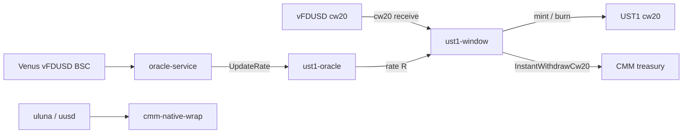
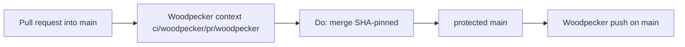

# Architecture overview

`code/ust1-window` is the Terra Classic **UST1** swap tree: CosmWasm **ust1-oracle**
/ **ust1-window** / **cmm-native-wrap**, shared `ust1-common` math, and the
BSC-polling **oracle-service**. Product addresses, `INV-*` math/oracle/limit
contracts, and operator deploy stay in [`README.md`](../README.md) and
[`DEPLOYMENT.md`](DEPLOYMENT.md). This file is the **merge and CI map**.

Catch-all `CODEOWNERS` removal is
[ADR 0001](adr/0001-remove-catchall-codeowners.md)
([#50](https://git.cl8y.com/code/ust1-window/issues/50)); do not duplicate that
narrative. Local invariant IDs are **H50-*** (this ticket). `code/hello`
architecture **H15** and sister **MG** / **H3** / **H5** tables are other trees’
copies of the same flags, not this repo’s issue number.

This tree is not the identity-smoke canary
([hello#15](https://git.cl8y.com/code/hello/issues/15) remains the **open**
CODEOWNERS canary). The **landed product pattern** is
[dex#1309](https://git.cl8y.com/code/cl8y-dex-terraclassic/issues/1309).

This tree does not PATCH Forgejo protection JSON, change CAC autoland
predicates, Coolify oracle hosting, or on-chain wasm migrate / InstantWithdraw
/ fee events. Those remain
[cl8y-forgejo#48](https://git.cl8y.com/PlasticDigits/cl8y-forgejo/issues/48),
[cl8y-agent-control#429](https://git.cl8y.com/PlasticDigits/cl8y-agent-control/issues/429),
and [agent-control #297](https://git.cl8y.com/PlasticDigits/cl8y-agent-control/issues/297).

Do not add a local `docs/INVARIANTS.md`. The issue body points at
[cl8y-forgejo’s copy](https://git.cl8y.com/PlasticDigits/cl8y-forgejo/src/branch/main/docs/INVARIANTS.md)
(not in this tree). Local merge-gate rules are **H50-*** here and in ADR 0001.
Do not copy cl8y-agent-control `docs/INVARIANTS.md` into this repo.

## Product tree



| Path | Role |
| --- | --- |
| [`contracts/ust1-oracle`](../contracts/ust1-oracle) | On-chain rate `R`, pause, throttle |
| [`contracts/ust1-window`](../contracts/ust1-window) | vFDUSD↔UST1 window + treasury pull |
| [`contracts/cmm-native-wrap`](../contracts/cmm-native-wrap) | 1:1 native wrap (no oracle) |
| [`smartcontracts-terraclassic/packages/ust1-common`](../smartcontracts-terraclassic/packages/ust1-common) | Shared math / oracle policy |
| [`oracle-service`](../oracle-service) | BSC poll → `UpdateRate` |
| [`scripts/`](../scripts) | Deploy helpers (no business logic) |
| [`docs/`](.) | This overview, ADR 0001, [`DEPLOYMENT.md`](DEPLOYMENT.md) |

On-chain addresses, code ids, and Coolify/Render oracle hosting stay in the
README / DEPLOYMENT registry. This overview does not redesign them. Operator
wasm migrate, `UpdateRate` keys, and treasury spender changes stay
[#297](https://git.cl8y.com/PlasticDigits/cl8y-agent-control/issues/297).

## Merge gate (H50)

Protected `main`. Operator
`GET /api/v1/repos/code/ust1-window/branch_protections` for the `main` rule.
**Author-attested** GET `updated_at` 2026-09-21T07:29:26Z (after
[cl8y-forgejo#48](https://git.cl8y.com/PlasticDigits/cl8y-forgejo/issues/48)
rollout on this repo). Unauthenticated GET returns **401** (`token is required`);
independent review of this SHA cannot re-verify without a token. Close still
**re-GETs**. Flag *values* match the canary table in `code/hello` architecture
**H15**; IDs here are **H50-*** because this ticket is
[#50](https://git.cl8y.com/code/ust1-window/issues/50).

A green Woodpecker `find` / `tree`-named clone-check, a green GitLab `rust`
job, or a green GitHub Actions run is **not** proof of **H50-2**, **H50-3**,
**H50-5**, **H50-8**, or **H50-9**. #50 must not PATCH protection. Re-read at
merge; fail on drift from the table below.

### GET-required (close criterion 4 and test 3 — same list)

These are the only protection fields this ticket depends on.

| ID | Field | Required value (author-attested 2026-09-21T07:29:26Z) |
| --- | --- | --- |
| **H50-2** | `enable_push` | `false` (no direct `main`, no force-push) |
| **H50-3** | `enable_status_check` + `status_check_contexts` | `true` and `ci/woodpecker/pr/woodpecker` |
| **H50-5** | `block_on_rejected_reviews` | `true` |
| **H50-8** | `block_on_official_review_requests` | `false` (leftover official requests on [#50](https://git.cl8y.com/code/ust1-window/pulls/50) / [#49](https://git.cl8y.com/code/ust1-window/pulls/49) must not block) |
| **H50-9** | `required_approvals` | `0` |

Do not include **H50-4** (`Do: merge`) in GET matching: it is the merge API,
not a protection field.

### GET-observed (do not touch; not in close matching)

| Field | Observed value | Rule |
| --- | --- | --- |
| `block_on_outdated_branch` | `true` | Do not PATCH from #50. Product head must rebase onto current `main` before merge. |
| `dismiss_stale_approvals` | `true` | Do not PATCH from #50. |
| `apply_to_admins` | `false` | Do not PATCH from #50. |

Close criterion 4 / test 3 must **not** be read as “GET equals this whole
architecture table.” Observed rows are inventory so an implementer does not
“fix” them.

### Non-GET rules

| ID | Rule |
| --- | --- |
| **H50-1** | No `CODEOWNERS` at the four Forgejo search paths (repo root, `docs/CODEOWNERS`, `.gitea/CODEOWNERS`, `.forgejo/CODEOWNERS`) requesting a user or team. File line is `@code/maintainers`; PR JSON team `name` is `maintainers` (org `code`, team id 4). Either form is the same leftover plant. Do not leave an empty or comments-only file; Forgejo still parses it. This tree has no vendor `CODEOWNERS`. |
| **H50-4** | Merge is SHA-pinned `Do: merge` (`head_commit_id`). Never document or use `force_merge`. |
| **H50-6** | No Coolify/Woodpecker secrets on `pull_request`. This tree does not grow an oracle-service deploy, wasm migrate, or `terrad tx` step from #50. Hello `telegram-failure` is forbidden. On-chain / Coolify / Render stays #297. |
| **H50-7** | This tree does not expand CAC merge/deploy/spend/custody policy. |

Official CODEOWNERS review is **not** a merge gate. Forgejo loads the first
existing file among `CODEOWNERS`, `docs/CODEOWNERS`, `.gitea/CODEOWNERS`, and
`.forgejo/CODEOWNERS` (Go-regexp, not GitHub globs). A catch-all `.*` still
plants team `maintainers` on every non-WIP PR that changes a matching path.
After ADR 0001, `test -f` fails on all four (**H50-1**). None of those paths
may contain a reviewer rule for any pattern.

Root README must point at this gate and ADR 0001 (product tables stay; add
the Decision 3 paragraph on the product PR, including that GitHub/GitLab
leftover hosting CI is not this required context and is not a merge hold).
Architecture-only is not a substitute for that pointer.



[`.github/workflows/ci.yml`](../.github/workflows/ci.yml) and
[`.gitlab-ci.yml`](../.gitlab-ci.yml) are leftover GitHub / GitLab hosting CI
(gitleaks + cargo fmt/clippy/test + optional LocalTerra). Forgejo
`has_actions=false`; those workflows **do not** post
`ci/woodpecker/pr/woodpecker`. A red GHA/GitLab check is not a merge hold. Do
not drop **H50-3** to “use GHA or GitLab instead.” Do not delete those files
in #50.

## Pipeline

`status_check_contexts` stays `ci/woodpecker/pr/woodpecker` (**H50-3**).
Today this tree has **no** root `.woodpecker.yaml`. Commit statuses on `main`
(`5408951`) and occupying
[#50](https://git.cl8y.com/code/ust1-window/pulls/50) (`8f05a0b`) are **empty**.
Empty statuses with no YAML match **missing YAML**, not a proven disabled
Woodpecker project. **WP-pre** (authentic **success** of that context after
the quoted YAML is on `#50`) is the enablement probe and a **land
prerequisite** for ADR 0001. It is not leftover and not a reason to drop
**H50-3** or `force_merge`. Do not look up `ci.cl8y.com/repos/42` (Forgejo
repo id **42** is `forge_remote_id`, not the Woodpecker UI id; dex is
Forgejo **49** / WP **7**). Authenticity pins live in ADR 0001 Observability;
do not check `creator == ci.cl8y.com`.

**MUST path:** repository-root `.woodpecker.yaml`. Do not add
`.woodpecker.yml`. Do not add `.woodpecker/` (directory mode can ignore root
YAML and name the workflow from the filename, posting
`ci/woodpecker/pr/<other>` and failing **H50-3**).

**#50 land bootstrap** (not this repo’s product test gate). Implement MUST
add exactly this file. Cargo tests (`make test-contracts` / GitLab `rust`
job) and GitHub gitleaks stay **ungated** by this ticket. Any later real
Forgejo CI **must extend this same root file**.

```yaml
# #50 land bootstrap. Posts context `ci/woodpecker/pr/woodpecker`.
# Not this repo's product test gate. Cargo tests stay ungated.
# Any later real CI must extend this same root file.
# MUST path: repository-root `.woodpecker.yaml`.
# Do not add `.woodpecker.yml` or `.woodpecker/`.

when:
  - event: [push, manual]
    branch: main
  - event: pull_request

steps:
  - name: tree
    image: alpine:3.22@sha256:14358309a308569c32bdc37e2e0e9694be33a9d99e68afb0f5ff33cc1f695dce
    commands:
      - test -n "$(find . -type f ! -path './.git/*' | head -1)"
```

`when:` is two list items: `push`/`manual` on `main`, plus **unfiltered**
`pull_request`. Do not attach `branch: main` to `pull_request` (that skips
feature-branch PRs and never posts the required context). `steps:` syntax,
not `pipeline:`. Image is the hello/dex digest pin, not a floating tag.
Command is the Token-SC / OTC / BASE_Buster / cmm `find` one-liner. Stock
Alpine has no `tree` binary; do not `apk add tree`. Step name `tree` is the
org stub name; the command is still `find`. No secrets, Coolify, Telegram,
BSC, or Terra. Do not copy hello’s `coolify-deploy` / `telegram-failure`. Do
not copy dex’s `scripts/ci/gitleaks-scan-tracked.sh` (that script does not
exist here). Do not port `.gitlab-ci.yml` `rust` or
`.github/workflows/ci.yml` onto this PR.

**WP-pre is the enablement probe.** Combine the quoted YAML onto `#50`. Do
not wait to confirm an active Woodpecker project before that push. Do not
wait on [cl8y-forgejo#48](https://git.cl8y.com/PlasticDigits/cl8y-forgejo/issues/48)
(404 from this tree) or closed
[dex#1247](https://git.cl8y.com/code/cl8y-dex-terraclassic/issues/1247)
(historical 44/44 `code/*` on 2026-09-12; this repo already existed). If
the YAML is on the PR and the context never posts: **land blocked** — open
a **new** leftover in **this** repo (dex#1247 shape: enable with
`forge_remote_id=42`, Forgejo webhook `https://ci.cl8y.com/api/hook` for
`push` + `pull_request`) **plus retrigger** (another push or Woodpecker
**manual**). `ready_for_review` is not a Woodpecker event. Do not POST a
fake commit status. Do not `force_merge`. Do not drop **H50-3**. Owners:
ADR 0001 Decision 8.

On-chain deploy is operator-run under
[#297](https://git.cl8y.com/PlasticDigits/cl8y-agent-control/issues/297),
not merge policy.

Root `.gitignore` already tracks `docs/` (`DEPLOYMENT.md` is on `main`). Do
not add a `docs/` ignore. Do not add a directory ignore of `docs/CODEOWNERS`
as a substitute for **H50-1** (absence, not ignore).
